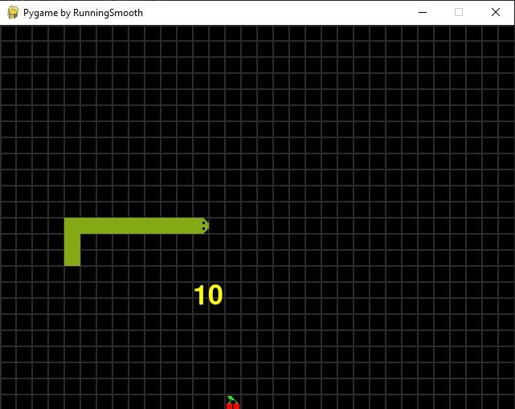

# PySnake



## Author

- [Tobias Pitsch](https://github.com/RunningSmooth)

## Used technologies / Frameworks

I use the following technologies / frameworks in my project:

- Python

After a while without programming in Python I wanted to refresh my knowledge. So I decided to start with an easier little project and whats more suitable than programming a snake game with Python. I already programmed a Python snake game for the university a few years ago but with [PyQt5](https://pypi.org/project/PyQt5/).

## Used 3rd Party Libraries

I use the following 3rd party libraries in my project:

Name | Reason
--- | ---
[Pygame](https://www.pygame.org/news) | For the GUI.

## Installation / Run

The following components must be installed locally:

- [Python](https://www.python.org/) v3.9.6

To run the project locally, enter the following in the command line / bash:

```console
$ git clone https://github.com/RunningSmooth/PySnake
$ cd PySnake
$ pip install -r requirements.txt
$ python app.py
```
---